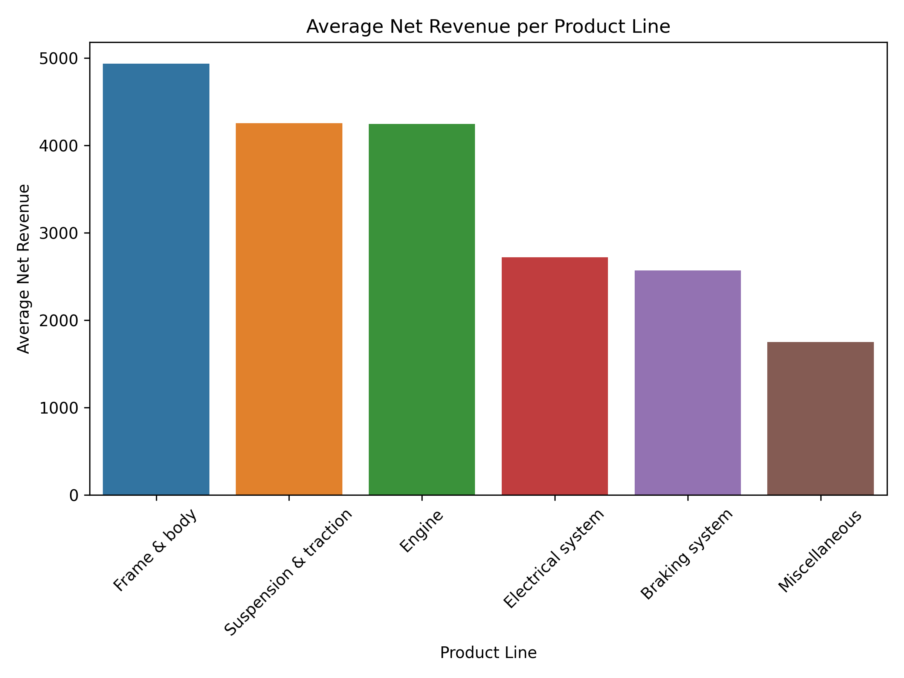
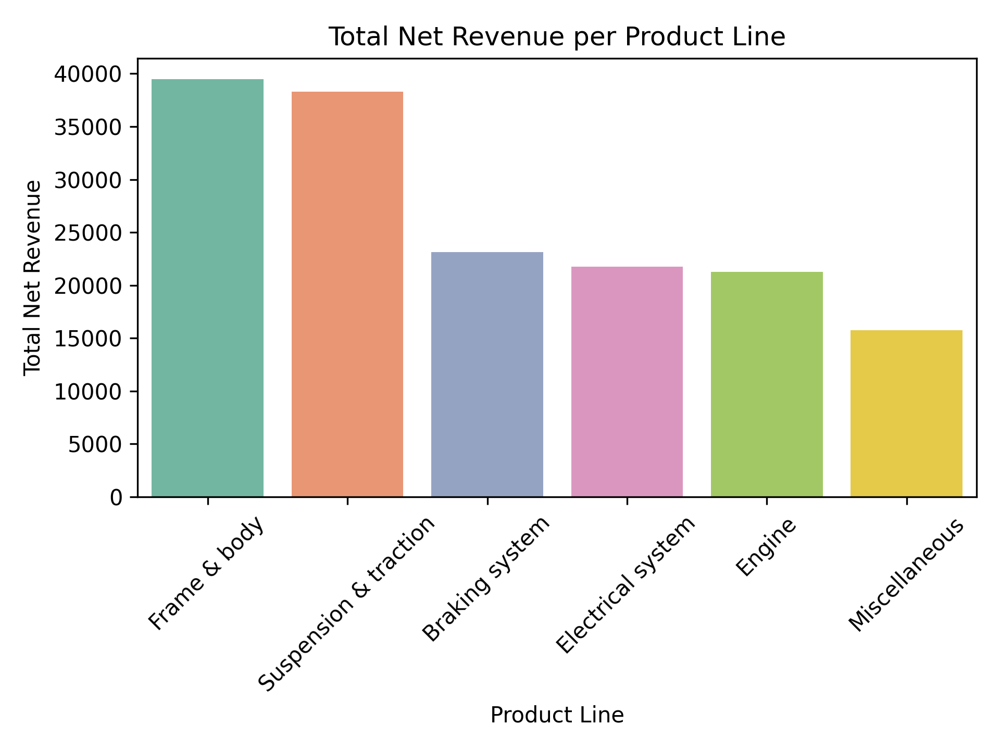
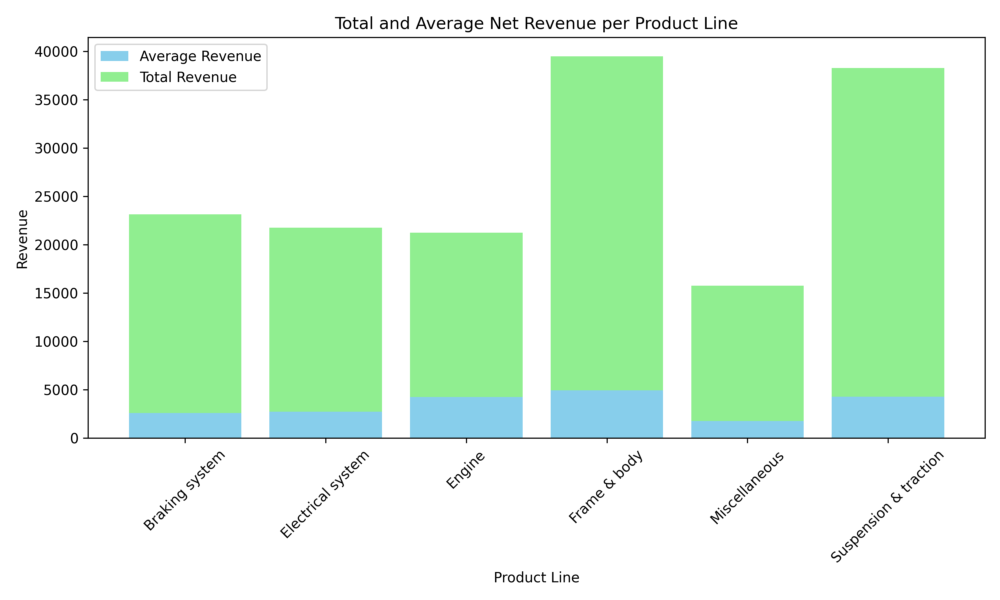
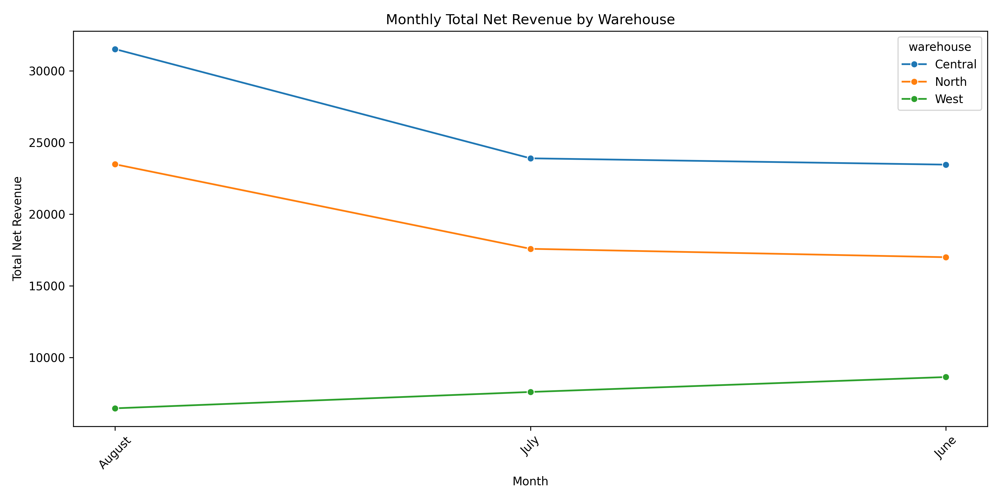

# 📊 Revenue Analysis (Python + SQL)

## 📌 Project Overview

This project analyzes revenue performance across different product lines and warehouses using SQL and Python. The goal is to identify key trends, compare performance across categories, and generate insights to support business decision-making.

---

## 🛠️ Tools & Technologies

* SQL (Wholesale data extraction from database)
* Python (Pandas, Matplotlib, Seaborn)
* Data Visualization

---

## 📁 Project Structure

```
SQL-Python-Revenue-Analysis/
│
├── data/
│   └── SQL_dataset_export.csv
│
├── images/
│   ├── avg_revenue_product_line.png
│   ├── total_revenue_product_line.png
│   ├── stacked_revenue.png
│   ├── monthly_product_line.png
│   └── monthly_warehouse.png
│
├── analysis.py
└── README.md
```

## 📈 Key Insights

* Some product lines generate high total revenue but lower average revenue per transaction
* Revenue trends vary across months, suggesting potential seasonality
* Certain warehouses consistently outperform others in total revenue

---

## 📊 Visualizations

### 🔹 Average Revenue per Product Line



---

### 🔹 Total Revenue per Product Line



---

### 🔹 Total vs Average Revenue (Stacked)



---

### 🔹 Monthly Revenue by Product Line


---

### 🔹 Monthly Revenue by Warehouse



---

## 📌 Business Recommendations

* Focus on high-performing product lines to maximize revenue growth
* Investigate underperforming warehouses to identify operational inefficiencies
* Leverage seasonal trends for better inventory and marketing planning

---


